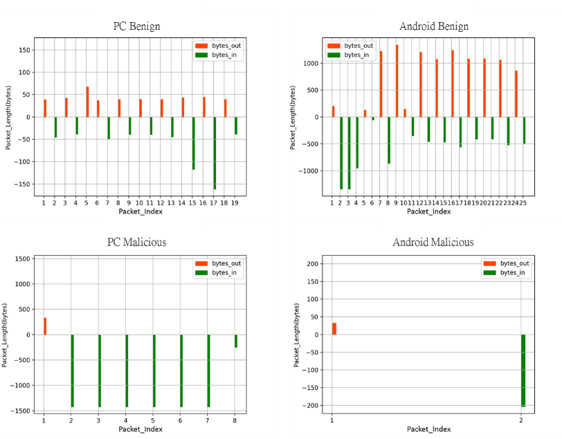
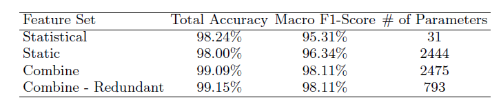

# Encrypted_Traffic_Classification
 With the rapid rise in using encrypted traffic, there are now more than 40% of websites traffic are encrypted. The method used to detect malware in the past such as port-based and payload-based has no longer efficiency. Although we could not take a look in the encrypted packet, we may use some feature to analysis. There had been works in this field detecting VPN-nonVPN, Tor traffic, and most of works is doing malware detection. However, they all focused on single task with a clean dataset, so we decided to target our work on identifying a **messy real-world traffic including VPN, Tor...etc**.
 
- [Dependency](#dependency)
- [Usage](#usage)
- [Visualization & Features](#visualization--features)
- [Results](#results)
- [Reference](#reference)

## Dependency
We use [joy 2.0](https://github.com/cisco/joy) tool to convert pcap file to json.

Also, we use [GNU parallel version 3](https://www.gnu.org/software/parallel/) to speed up the data preprocessing.


This project is dependent on Python 

- keras == 2.2.0
- numpy == 1.14.0
- pandas == 0.22.0
- matplotlib == 2.1.2
- scikit-learn == 0.19.1
- xgboost == 0.80
- argparse == 3.2


## Usage

### Folder and Dataset

To start this project you can download dataset from [VPN-nonVPN dataset (ISCXVPN2016)](https://www.unb.ca/cic/datasets/vpn.html)[[1]](#1)
and unzip those file to `./data/PCAP`.
 
    .
    ├── ...
    ├── data                    
    │   ├── PCAP                  # where pcap file should be
    │   ├── JSON                  # the output json file from joy(after sleuth)
    |   ├── tmpJSON               # tmp json file from joy
    │   └── pcap_to_json.sh       # turn pcap to json file
    ├── prepro
    │   ├── multi_gen.sh          # script to turn json file into table
    |   └── ...                 
    ├── main
    │   ├── train.py              # main function to train
    │   ├── TRAIN.sh              # script to train
    |   └── ...                   
    └── ...

### Data Preprocessing 

(optional) You can convert pcap file to json, do:

Before execute the code below, please make sure there are ~/joy/bin/joy and ~/joy/sleuth files in your computer. The fourth input please fill in a integer between 0 to 200, which means the packet num in the flow. The example below extract the first 50 packets in a flow and transform the informations to json file.

```shell
# 4 parameters : input folder, temporary folder, output folder, maximun number of packets 
cd data && sh pcap_to_json.sh PCAP tmpJSON JSON 50
```

Or skipping above steps, using the json file we have already converted:

```shell
# To use the table generator you should decide 
# 3 parameters : input folder, output table, malicious or not
cd prepro &&　sh multi_gen.sh ../data/JSON Table.csv 0 && python3 toTrain.py Table.csv
```

### Training & Evaluation

To train a model, do:

```shell
# To train the model, you should specify the mode(DNN/XGB):
cd ./main && sh TRAIN.sh DNN
```

Or specify other parameters:

```shell
# There are up to 5 parameters: mode, data path, output folder, batch size, patience :
cd ./main && python3 train.py --mode DNN --source_data_folder ../data --output_folder ./output --batch_size 1024 --patience 1000 
```


## Visualization & Features

 To determine the features, we started from data visualization. In the FIG. 1 below, the different patterns of PSS are shown in the four pictures. In the two pictures of malicious flow, there are only one small packet sent out, while the received packets are larger than it. To go further into the pattern of PC malicious flow(dataset not provided) shown in the FIG. 1, there are a few received packets which are about 1500 bytes after the sent packet. This is the classical infection process of Trojan. After user send a request related to the Trojan, user's PC will receive lots of packets which are always about 1500 bytes. After analysis, we picked static feature PSS, Byte Distribution, TLS handshake and DNS information as our first feature set. We also used different Machine Learning technique to do classification which is my major role in our team. 
<p align="center">

</p>
<p align="center"> FIG 1 </p>

## Results

Using Tensorflow, we had tried a lot of structure to deal with it, such as DNN, CNN, RandomForest, Autoencoder, TSDNN…. To get better performance, we also tried to find more useful feature in other related work which need a lot of reading. In TABLE I, the accuracy could reach 99\% and also the macro F1-Score is over 98\%.
<p align="center">

</p>
<p align="center"> TABLE 1 </p>

## Reference
<a id="1">[1]</a> 
*Gerard Drapper Gil, Arash Habibi Lashkari, Mohammad Mamun, Ali A. Ghorbani (2016). 
Characterization of Encrypted and VPN Traffic Using Time-Related Features 
In Proceedings of the 2nd International Conference on Information Systems Security and Privacy(ICISSP 2016) , pages 407-414, Rome, Italy.*


